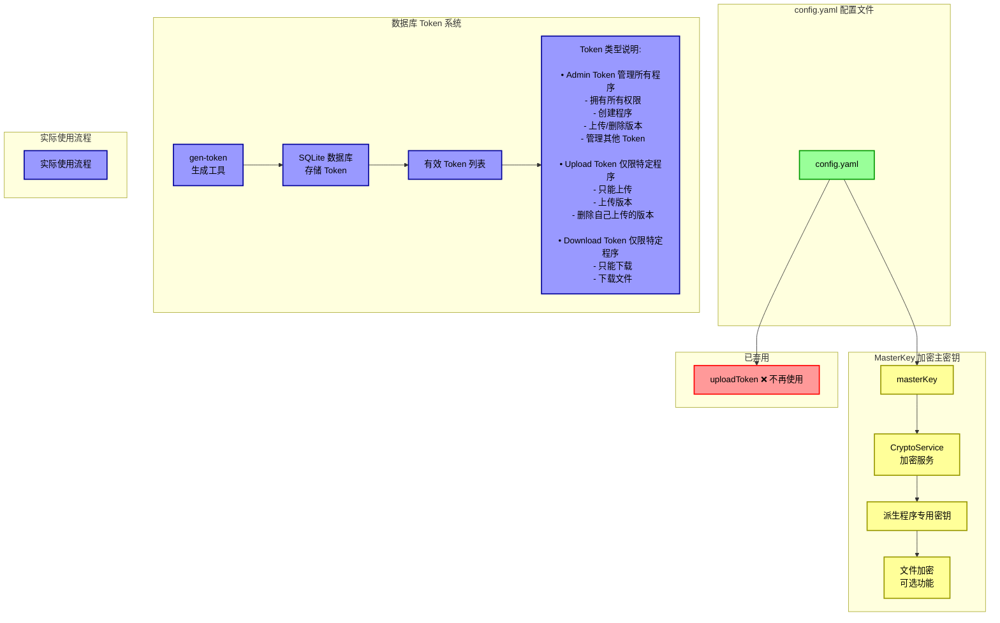
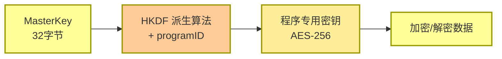
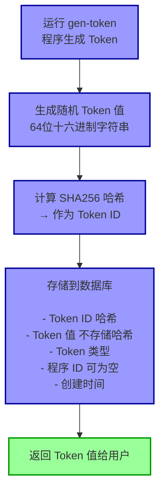
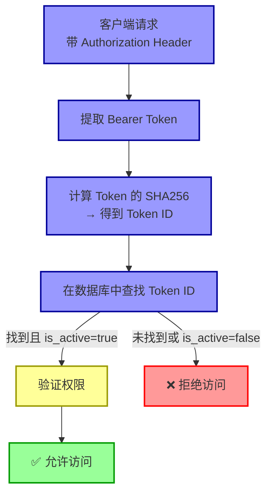
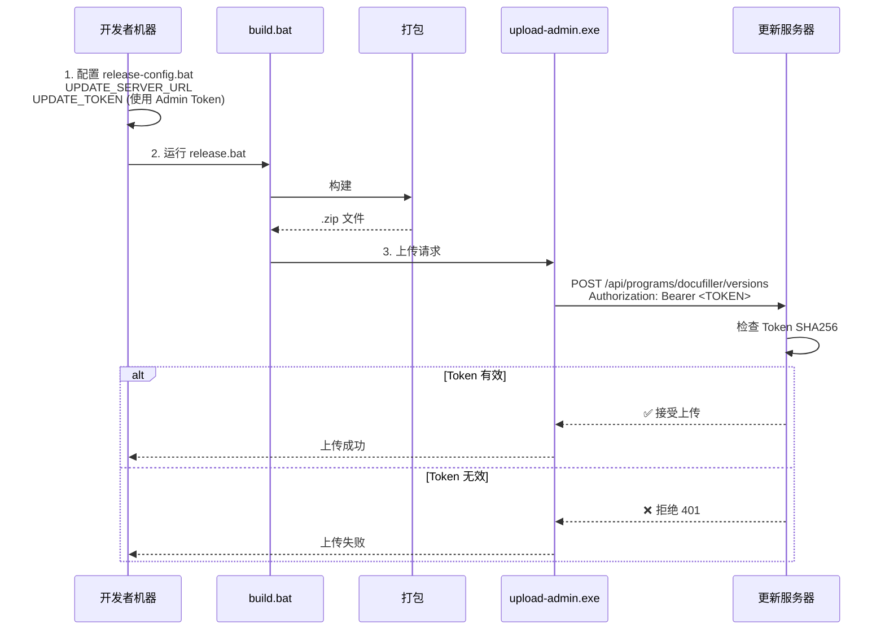

# 更新服务器认证与密钥系统架构说明

## 核心概念

更新服务器有 **3 种密钥/Token**，每种都有不同的用途：



---

## 详细说明

### 1. MasterKey (加密主密钥)

**位置**：`config.yaml` → `crypto.masterKey`

**用途**：用于派生程序专用密钥，对敏感数据进行加密

**工作流程**：


**重要提示**：
- 目前用于**文件加密**功能（可选）
- 不是用于认证的！
- 如果不需要加密功能，可以保持默认值

---

### 2. uploadToken (已弃用)

**位置**：`config.yaml` → `api.uploadToken`

**状态**：❌ **已弃用，不再使用！**

**原因**：
- 原本设计为简单的固定 Token
- 后来改用数据库 Token 系统（更灵活、更安全）
- 配置文件中的这个值已经不起作用

**操作**：
- 可以忽略这个配置
- 或者删除这一行（但不删除也不会影响）

---

### 3. 数据库 Token 系统（当前使用）

#### 3.1 Token 生成流程



#### 3.2 Token 类型与权限

| Token 类型 | programID | 权限说明 |
|-----------|-----------|---------|
| **Admin** | 空 | 管理所有程序，创建程序，管理 Token |
| **Upload** | 特定程序 | 只能上传/删除该程序的版本 |
| **Download** | 特定程序 | 只能下载该程序的文件 |

#### 3.3 Token 认证流程



---

## 实际使用流程

### 首次部署流程

```mermaid
graph TB
    subgraph Step1["第1步: 编译服务器"]
        S1["cd update-server<br/>go build -o bin/update-server.exe"]
    end

    subgraph Step2["第2步: 生成 Admin Token"]
        S2["go run cmd/gen-token/main.go<br/><br/>输出:<br/>Admin Token: db2d387f... ← 保存这个!<br/>Token ID: 1022d95b..."]
    end

    subgraph Step3["第3步: 启动服务器"]
        S3[".\bin\update-server.exe<br/><br/>服务器会:<br/>• 加载 config.yaml<br/>• 初始化数据库<br/>• 启动在 0.0.0.0:8080"]
    end

    subgraph Step4["第4步: 创建程序记录"]
        S4["curl -X POST http://localhost:8080/api/programs<br/>  -H 'Authorization: Bearer <ADMIN_TOKEN>'<br/>  -H 'Content-Type: application/json'<br/>  -d '{\"programId\":\"docufiller\",...}'"]
    end

    S1 --> S2
    S2 --> S3
    S3 --> S4

    style S1 fill:#99f,stroke:#009,stroke-width:2px
    style S2 fill:#99f,stroke:#009,stroke-width:2px
    style S3 fill:#99f,stroke:#009,stroke-width:2px
    style S4 fill:#99f,stroke:#009,stroke-width:2px
```

### 发布版本流程



---

## 配置文件对比

### config.yaml (服务器配置)

```yaml
# ✅ 使用中 - 加密主密钥
crypto:
  masterKey: "change-this-to-a-secure-32-byte-key-in-production"

# ❌ 已弃用 - 不再使用
api:
  uploadToken: "change-this-token-in-production"  # 忽略此配置

# ✅ 使用中 - Token 在数据库中管理
# (通过 gen-token 工具生成)
```

### release-config.bat (客户端发布配置)

```bat
# ✅ 使用中 - 服务器地址
set UPDATE_SERVER_URL=http://172.18.200.47:58100

# ✅ 使用中 - 从 gen-token 获取的 Admin Token
set UPDATE_TOKEN=db2d387ff07aed70562da78115a45edd2821740ebd3233e9dac4cb163eec67cc

# ✅ 使用中 - 管理工具路径
set UPLOAD_ADMIN_PATH=C:\WorkSpace\Go2Hell\src\github.com\LiteHomeLab\update-server\bin\upload-admin.exe
```

---

## 常见问题

### Q1: 为什么既有 MasterKey 又有 Token？

**答**：它们用途不同：
- **MasterKey** → 用于**文件加密**（数据安全）
- **Token** → 用于**API 认证**（访问控制）

```mermaid
graph TB
    subgraph MKUsage["MasterKey 的使用场景 可选"]
        F1["原始文件<br/>可执行文件"]
        CS1["CryptoService<br/>派生程序专用密钥"]
        EF["加密文件"]
        ST["存储加密的文件"]

        F1 -->|"MasterKey"| CS1
        CS1 --> EF
        EF --> ST
    end

    subgraph TokenUsage["Token 的使用场景 必需"]
        F2["upload-admin<br/>发布工具"]
        AM["AuthMiddleware<br/>Authorization Header"]
        VP["验证权限"]
        AD["允许/拒绝 API"]

        F2 -->|"Token"| AM
        AM --> VP
        VP --> AD
    end

    style F1 fill:#ff9,stroke:#990,stroke-width:2px
    style CS1 fill:#ff9,stroke:#990,stroke-width:2px
    style EF fill:#ff9,stroke:#990,stroke-width:2px
    style ST fill:#ff9,stroke:#990,stroke-width:2px
    style F2 fill:#99f,stroke:#009,stroke-width:2px
    style AM fill:#99f,stroke:#009,stroke-width:2px
    style VP fill:#99f,stroke:#009,stroke-width:2px
    style AD fill:#99f,stroke:#009,stroke-width:2px
```



### Q2: config.yaml 中的 uploadToken 还需要配置吗？

**答**：**不需要！** 这个配置已经废弃。

### Q3: Token 存在哪里？

**答**：存储在 SQLite 数据库中（`data/versions.db`）

表结构：
```
tokens 表:
┌─────────┬──────────┬──────────┬───────────┬──────────┐
│ Token ID│ Token值  │ Token类型│ ProgramID │ 是否激活  │
├─────────┼──────────┼──────────┼───────────┼──────────┤
│ 哈希值   │ 不存储   │ admin    │ 空        │ true     │
│ 哈希值   │ 不存储   │ upload   │ docufiller│ true     │
│ 哈希值   │ 不存储   │ download │ docufiller│ true     │
└─────────┴──────────┴──────────┴───────────┴──────────┘
```

**安全设计**：数据库中只存储 Token 的 SHA256 哈希，不存储原始 Token！

### Q4: 如何生成新的 Token？

**答**：运行 gen-token 工具

```bash
# 当前只能生成 Admin Token
go run cmd/gen-token/main.go

# 如需生成其他类型的 Token，需要修改代码或直接操作数据库
```

---

## 简化记忆版

```
更新服务器密钥系统 (3个东西)

1. MasterKey (config.yaml)
   └─ 用途: 文件加密
   └─ 状态: 可选功能，默认值即可

2. uploadToken (config.yaml)
   └─ 用途: ~~曾经用于认证~~
   └─ 状态: ❌ 已废弃，忽略它！

3. 数据库 Token (由 gen-token 生成)
   └─ 用途: API 认证 (必需!)
   └─ 类型: Admin / Upload / Download
   └─ 生成: go run cmd/gen-token/main.go
   └─ 使用: 配置在 release-config.bat 中
```

---

**文档版本**：1.0
**最后更新**：2026-01-20
