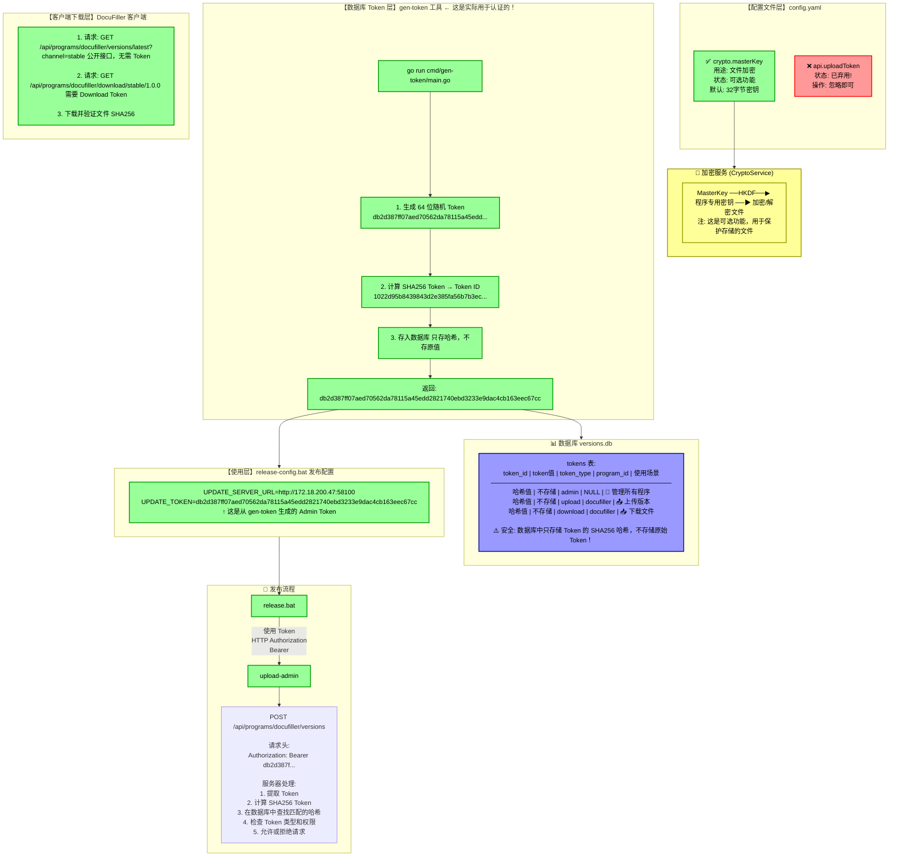
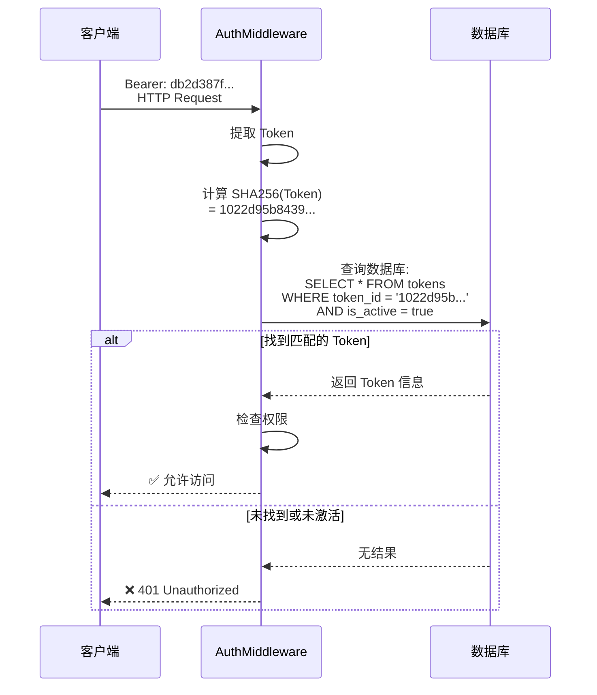

# 密钥与 Token 系统快速参考

## 一张图看懂所有密钥和 Token



---

## 三步配置快速指南

### 第 1 步：生成 Admin Token（只需执行一次）

```bash
# 在服务器目录执行
cd C:\WorkSpace\Go2Hell\src\github.com\LiteHomeLab\update-server
go run cmd/gen-token/main.go

# 输出示例:
# Admin Token: db2d387ff07aed70562da78115a45edd2821740ebd3233e9dac4cb163eec67cc
#              ↑ 复制这个完整的 Token 字符串
```

### 第 2 步：配置客户端（开发者机器）

```bat
# 编辑 DocuFiller 项目中的
# scripts\config\release-config.bat

set UPDATE_SERVER_URL=http://172.18.200.47:58100
set UPDATE_TOKEN=db2d387ff07aed70562da78115a45edd2821740ebd3233e9dac4cb163eec67cc
set UPLOAD_ADMIN_PATH=C:\WorkSpace\Go2Hell\src\github.com\LiteHomeLab\update-server\bin\upload-admin.exe
```

### 第 3 步：发布版本

```bash
# 1. 更新 DocuFiller.csproj 版本号
# 2. 创建 Git 标签
git tag v1.0.0
git push origin v1.0.0

# 3. 执行发布
scripts\release.bat
```

---

## 密钥/Token 一览表

| 名称 | 位置 | 用途 | 状态 | 是否必需 |
|------|------|------|------|----------|
| **MasterKey** | config.yaml → crypto.masterKey | 文件加密 | 使用中 | ❌ 可选 |
| **uploadToken** | config.yaml → api.uploadToken | ~~认证~~ | ❌ 已弃用 | ❌ 不使用 |
| **Admin Token** | 数据库 | 管理所有操作 | 使用中 | ✅ 必需 |
| **Upload Token** | 数据库 | 上传特定程序 | 使用中 | ⚠️ 可选 |
| **Download Token** | 数据库 | 下载特定程序 | 使用中 | ⚠️ 可选 |

---

## 认证流程简化图



---

**文档版本**：1.0
**最后更新**：2026-01-20
